# Arquitetura do Sistema - Plataforma de Streaming

## Diagrama de Arquitetura Geral

```mermaid
architecture-beta
    group frontend(cloud)[Frontend]
    group backend(cloud)[Backend Services]
    group streaming(server)[Streaming Infrastructure]
    group data(database)[Data Layer]
    group monitoring(cloud)[Monitoring]

    service react[React App] in frontend
    service api[Stream Service] in backend
    service consumer[Consumer Service] in backend
    service metrics[Metrics Service] in backend
    
    service nginx_rtmp[Nginx RTMP] in streaming
    service ffmpeg[FFmpeg] in streaming
    service nginx_hls[Nginx HLS] in streaming
    
    service postgres[PostgreSQL] in data
    service redis[Redis Cache] in data
    service kafka[Kafka] in data
    
    service prometheus[Prometheus] in monitoring
    service grafana[Grafana] in monitoring

    react:R -- L:api
    api:R -- L:postgres
    api:R -- L:redis
    api:B -- T:kafka
    consumer:T -- B:kafka
    nginx_rtmp:R -- L:ffmpeg
    ffmpeg:R -- L:nginx_hls
    nginx_hls:T -- B:react
    metrics:L -- R:prometheus
    prometheus:R -- L:grafana
```

## Fluxo de Criação de Stream

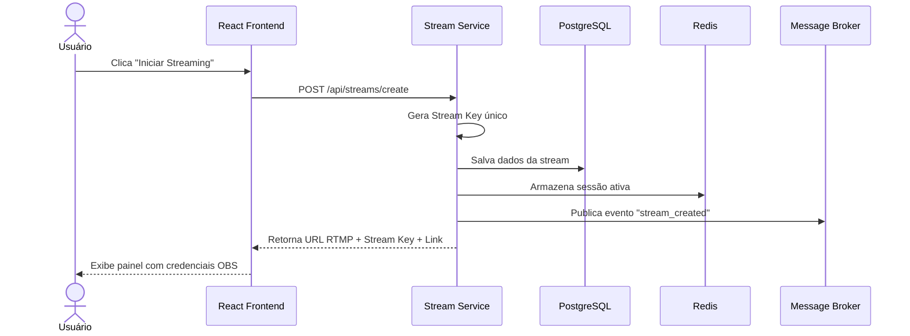

## Fluxo de Transmissão de Vídeo

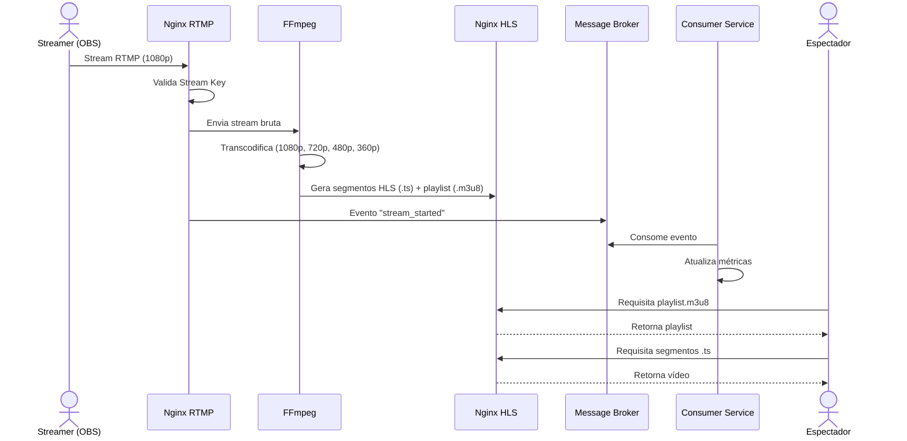

## Fluxo de Visualização

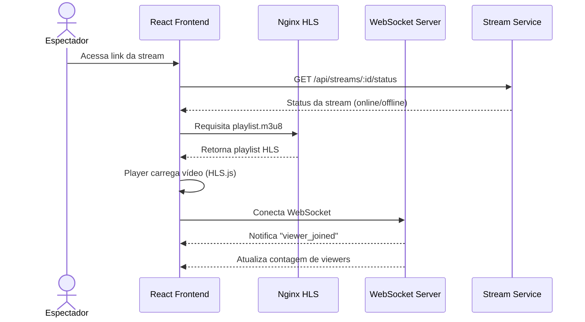

## Arquitetura de Componentes (C4 - Nível Container)

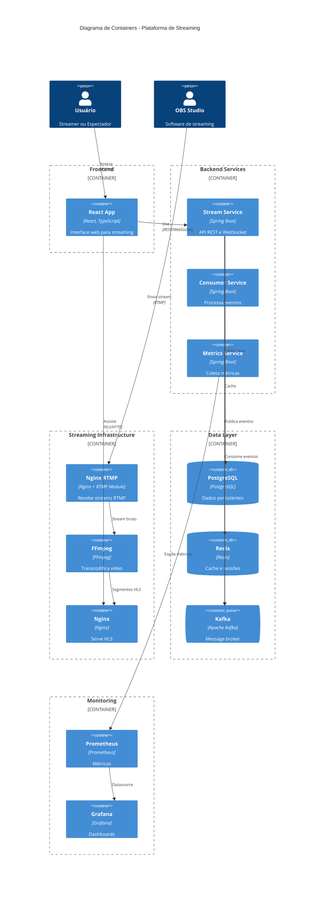

## Estrutura de Pastas do Projeto

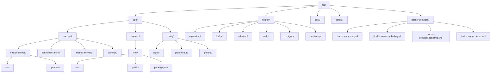

## Alternativas Tecnológicas para Comparação

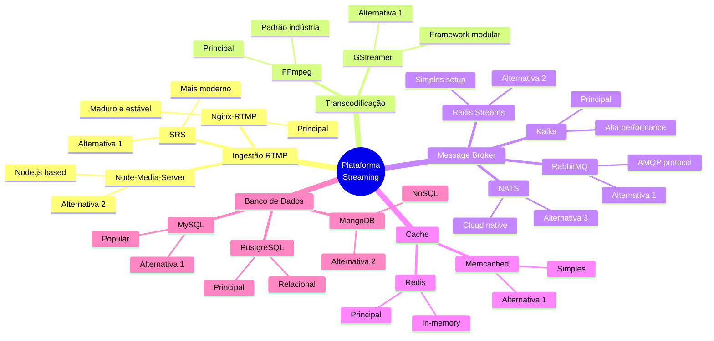

## Diagrama de Estados da Stream

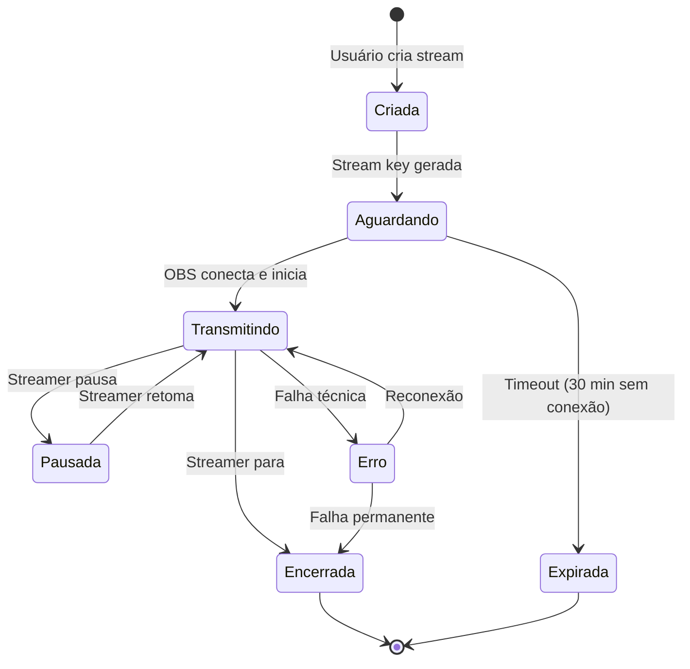

## Fluxo de Dados com Métricas

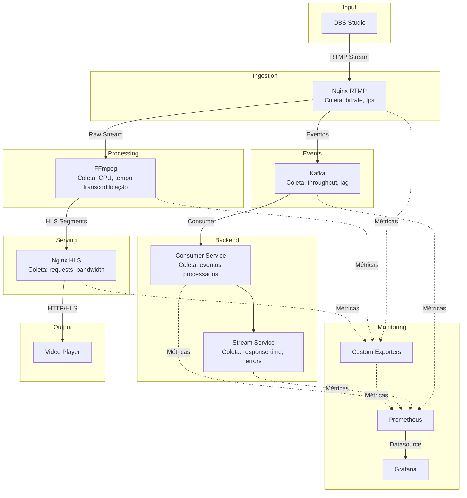

## Pipeline de Deployment Local

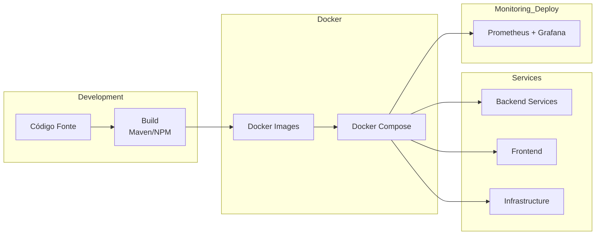

## Comparação de Performance - Template

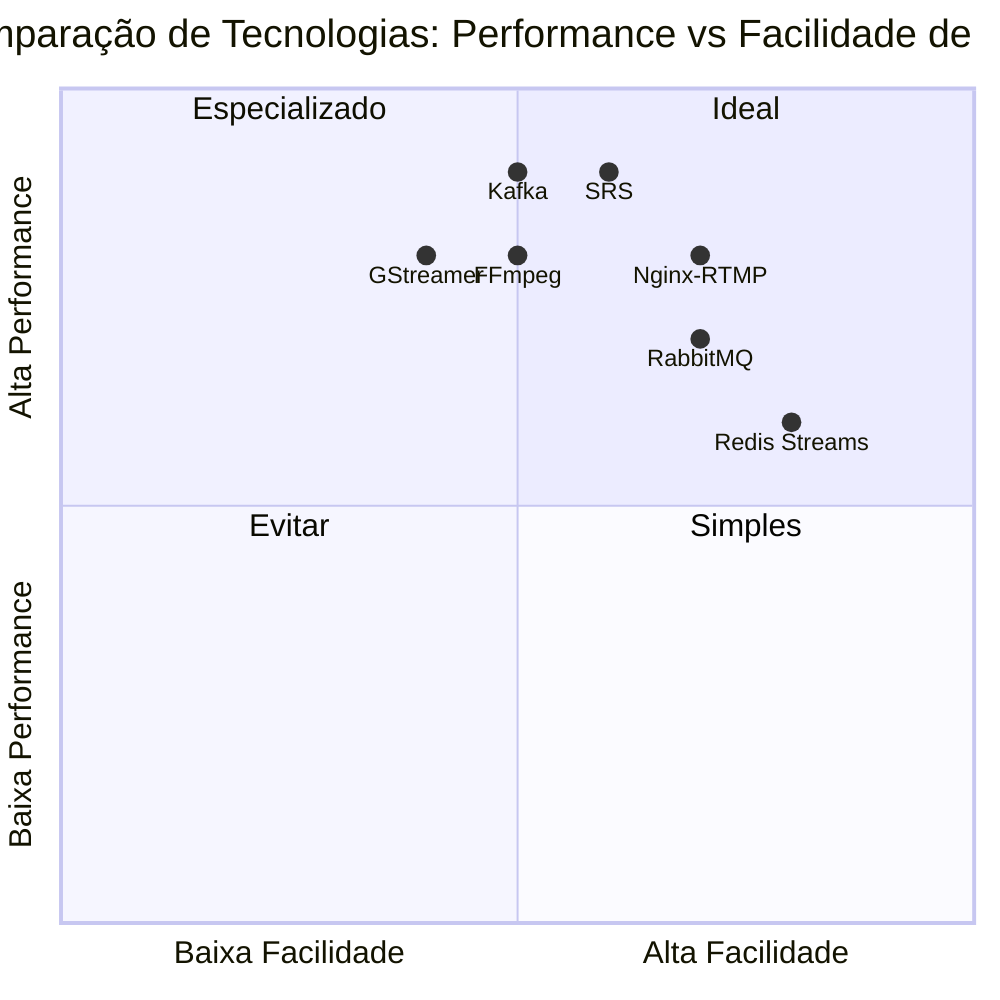

## Cronograma do Projeto (Gantt)

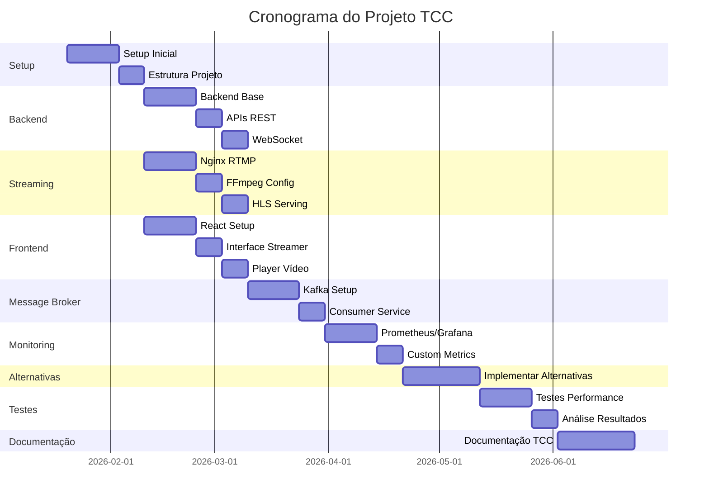

## Matriz de Decisão Tecnológica

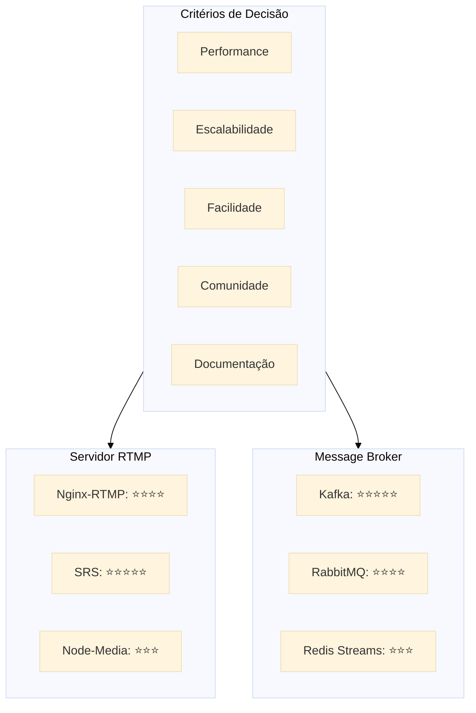

---

**Nota**: Estes diagramas fornecem uma visão completa da arquitetura proposta. Podem ser ajustados conforme o desenvolvimento do projeto avança.
