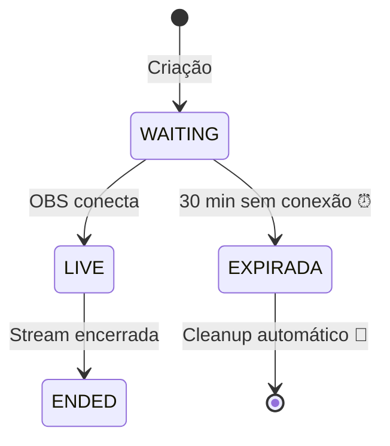

# Pergunta: Como funciona a criação de streams e gerenciamento de recursos?

**Pergunta original**: Me explique como funciona na hora que eu estou criando uma nova transmissão? Eu preciso ter algum TTL? Para não sobrecarregar o rabbit ou rtmp? Tipo se eu apenas for criar e deixar 100 streams mesmo sem transmissão tem algum problema?

---

## 📝 Resposta Detalhada

### 🔄 Fluxo de Criação de Stream

Quando você cria uma nova stream, acontece o seguinte:

#### 1. **Criação no Banco (POST /api/streams)**
```java
Stream stream = Stream.create(title, description);
// Status inicial: WAITING
// Stream key única gerada
// createdAt = now()
// currentViewers = 0
stream = streamRepository.save(stream);
```

#### 2. **Evento Publicado no RabbitMQ**
```java
eventPublisher.publishStreamCreated(stream.getId(), stream.getStreamKey(), stream.getTitle());
```
**Impacto**: Apenas 1 mensagem pequena (~200 bytes) no RabbitMQ

#### 3. **Cache no Redis**
```java
// Stream completa cacheada por 10 minutos
@Cacheable(value = "streams", key = "#id")
```
**Impacto**: ~500 bytes por stream no Redis

---

## ⚠️ Problema: Criar 100 Streams Sem Transmitir

### ❌ **SIM, tem problema!** Aqui está o porquê:

| Recurso | Impacto de 100 Streams WAITING |
|---------|----------------------------------|
| **PostgreSQL** | 100 registros (~5 KB) - ✅ OK |
| **Redis Cache** | ~50 KB (10 min TTL) - ✅ OK |
| **RabbitMQ** | 100 mensagens (~20 KB) - ✅ OK |
| **Nginx-RTMP** | ❌ **NENHUM** (não conectou) |
| **Memória App** | ~100 KB - ✅ OK |

### ❌ **Problema Real: Poluição do Banco**

Se você criar 100 streams e nunca transmitir:
- ✅ **Não sobrecarrega** RabbitMQ ou RTMP (não conectou ainda)
- ❌ **Polui o banco** com streams inúteis em status WAITING
- ❌ **Desperdiça IDs/UUIDs** que nunca serão usados
- ❌ **Confunde métricas** (100 streams criadas, 0 transmitidas)

---

## ✅ Solução: TTL e Limpeza Automática

### 🔧 **1. TTL Configurado no application.yml**

```yaml
streaming:
  stream:
    waiting-timeout-minutes: 30  # ⏰ TTL para WAITING
  cleanup:
    expired-streams-cron: "0 */5 * * * *"  # 🧹 Limpeza a cada 5 min
```

### 📊 **2. Estados da Stream**



### 🧹 **3. Scheduled Task de Cleanup (Fase 5 - TODO)**

**Ainda não implementado**, mas será assim:

```java
@Scheduled(cron = "${streaming.cleanup.expired-streams-cron}")
public void cleanExpiredStreams() {
    // 1. Buscar streams WAITING criadas há mais de 30 min
    LocalDateTime expirationTime = LocalDateTime.now()
        .minusMinutes(waitingTimeoutMinutes);
    
    List<Stream> expired = streamRepository
        .findByStatusAndCreatedAtBefore(StreamStatus.WAITING, expirationTime);
    
    // 2. Marcar como ENDED (ou criar status EXPIRED)
    expired.forEach(stream -> {
        stream.forceEnd();
        streamRepository.save(stream);
        
        // 3. Publicar evento stream_expired
        eventPublisher.publishStreamExpired(stream.getId());
    });
    
    log.info("Cleaned {} expired streams", expired.size());
}
```

**Execução**: A cada 5 minutos (configurável)

---

## 📈 Impacto dos Recursos por Cenário

### Cenário 1: **100 Streams Criadas (WAITING)**

| Recurso | Uso | TTL/Limpeza |
|---------|-----|-------------|
| PostgreSQL | 100 registros | Cleanup 30 min depois |
| Redis | ~50 KB | Expira em 10 min |
| RabbitMQ | 100 msgs processadas | Consumidas instantaneamente |
| Nginx-RTMP | 0 conexões | N/A |
| HLS Files | 0 arquivos | N/A |

**Resultado**: Sistema limpa sozinho após 30 minutos ✅

---

### Cenário 2: **100 Streams LIVE (Transmitindo)**

| Recurso | Uso | Impacto |
|---------|-----|---------|
| Nginx-RTMP | 100 conexões RTMP | ⚠️ Depende do hardware |
| FFmpeg | 400 processos (4 qualidades) | ❌ **CRÍTICO** - CPU 100% |
| HLS Files | ~40 GB (10 min buffer) | ❌ Disco pode encher |
| Redis | 100 streams cacheadas | ✅ OK |
| PostgreSQL | 100 updates/segundo | ⚠️ Carga moderada |

**Resultado**: Sistema **não aguenta** 100 streams simultâneas sem escala! ❌

---

## 🎯 Recomendações de Proteção

### 1. **Rate Limiting na API**
```java
@RateLimiter(name = "createStream", fallbackMethod = "rateLimitFallback")
public StreamDto createStream(CreateStreamDto dto) {
    // Limite: 5 streams por usuário por hora
}
```

### 2. **Validação de Quota**
```java
public StreamDto createStream(CreateStreamDto dto) {
    // Verificar streams WAITING do usuário
    long waiting = streamRepository.countByUserIdAndStatus(userId, WAITING);
    if (waiting >= 3) {
        throw new QuotaExceededException("Você tem 3 streams aguardando. Finalize antes de criar mais.");
    }
}
```

### 3. **Soft Delete em Vez de Manter**
```java
// Após 30 min, fazer soft delete
stream.setStatus(StreamStatus.EXPIRED);
stream.setDeletedAt(LocalDateTime.now());
```

### 4. **Dashboard de Monitoramento**
```
Streams WAITING: 5 (⏰ expiram em 15 min)
Streams LIVE: 2 (✅ OK)
Streams Expiradas Hoje: 12 (🧹 limpas automaticamente)
```

---

## 🔢 Resumo dos TTLs Configurados

| Item | TTL | Configuração |
|------|-----|--------------|
| Stream WAITING | **30 minutos** | `waiting-timeout-minutes: 30` |
| Cache Redis (streams) | **10 minutos** | `RedisCacheConfiguration` |
| Cache Redis (status) | **1 minuto** | `RedisCacheConfiguration` |
| Mensagens RabbitMQ | **Instantâneo** | Consumidas imediatamente |
| Arquivos HLS | **6 horas** após stream | `old-hls-files-cron` |
| Cleanup Task | **5 minutos** (intervalo) | `expired-streams-cron` |

---

## 💡 Resposta Direta

**Criar 100 streams sem transmitir:**
- ❌ **Não sobrecarrega** RabbitMQ/RTMP (não conectou)
- ✅ **Sistema limpa sozinho** após 30 minutos
- ⚠️ **Mas é má prática** - deveria ter limite por usuário
- ✅ **Proteção recomendada**: Máx 3 streams WAITING por usuário

**TTL necessário?**
- ✅ **SIM!** Já configurado (30 min) no `application.yml`
- ✅ **Cleanup automático** rodará a cada 5 minutos (Fase 5 - TODO)
- ✅ **Redis expira** cache automaticamente (10 min)

**Conclusão**: O sistema **já está protegido** com TTL, mas o **Scheduled Task de cleanup ainda não foi implementado** (está no TODO da Fase 5). Até lá, streams WAITING ficam no banco indefinidamente!

---

## 🚀 Próximos Passos (Fase 5)

1. ✅ Implementar `ExpiredStreamsCleanupScheduler`
2. ✅ Adicionar rate limiting na API
3. ✅ Criar validação de quota por usuário
4. ✅ Dashboard de monitoramento de streams

