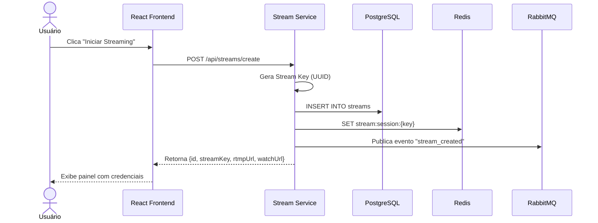
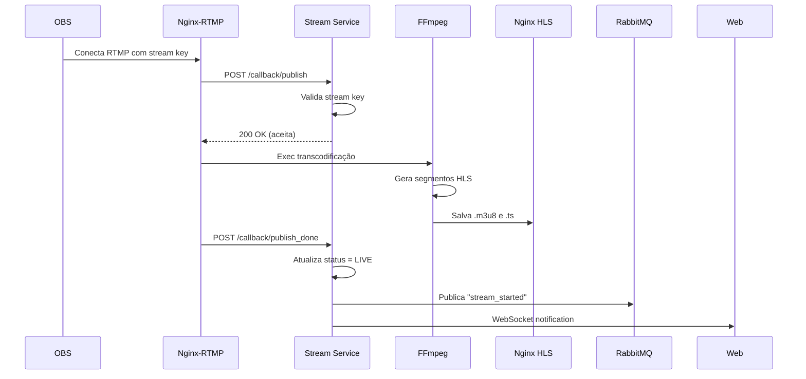
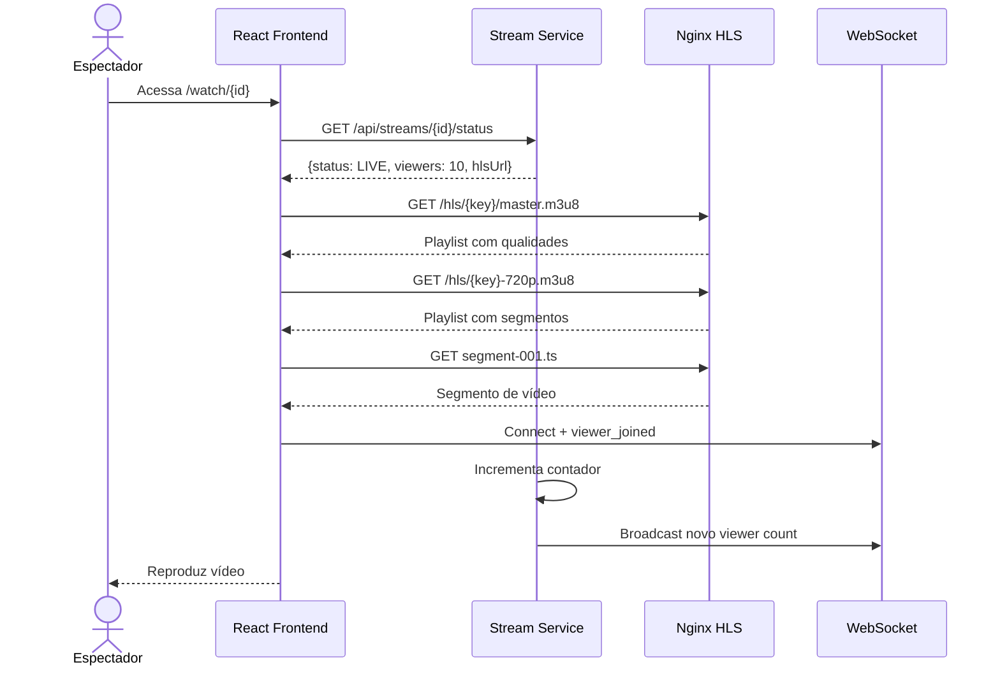
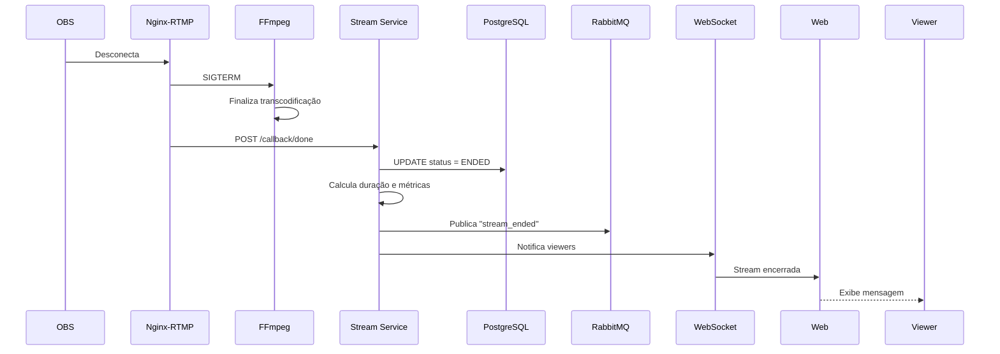

# Documentação v2.0 - Plataforma de Streaming com Análise Comparativa

## 📚 Índice

1. [Visão Geral do Projeto](#-visão-geral-do-projeto)
2. [Arquitetura do Sistema](#-arquitetura-do-sistema)
3. [Stack Tecnológico](#-stack-tecnológico)
4. [Componentes Principais](#-componentes-principais)
5. [Fluxos do Sistema](#-fluxos-do-sistema)
6. [Alternativas Tecnológicas](#-alternativas-tecnológicas)
7. [Estrutura do Projeto](#-estrutura-do-projeto)
8. [Guias de Configuração](#-guias-de-configuração)
9. [Monitoramento e Métricas](#-monitoramento-e-métricas)
10. [API Reference](#-api-reference)
11. [Estratégia de Testes](#-estratégia-de-testes)
12. [Referências](#-referências)

---

## 🎯 Visão Geral do Projeto

### O que é este Projeto?

Este **Trabalho de Conclusão de Curso (TCC)** apresenta o desenvolvimento de uma **plataforma de streaming de vídeo ao vivo** com um diferencial único: não apenas criar um sistema funcional, mas realizar uma **análise comparativa quantitativa e qualitativa** de diferentes tecnologias que podem implementar as mesmas funcionalidades.

### Problema que Resolve

No ecossistema de streaming e arquitetura de microserviços, desenvolvedores frequentemente enfrentam perguntas como:

- 🤔 Qual servidor RTMP escolher: Nginx-RTMP ou SRS?
- 🤔 FFmpeg ou GStreamer para transcodificação?
- 🤔 RabbitMQ, Redis Streams ou NATS para mensageria?
- 🤔 Como essas escolhas impactam latência, uso de recursos e escalabilidade?

Este projeto fornece **dados concretos e análises objetivas** para auxiliar na tomada dessas decisões.

### Funcionalidades Principais

#### Para Streamers (Criadores de Conteúdo)
- ✅ Acesso sem cadastro via navegador (`stream.localhost/`)
- ✅ Um clique em "Iniciar Streaming" gera automaticamente:
  - URL do servidor RTMP
  - Stream Key única e segura
  - Link compartilhável para espectadores
- ✅ Painel de controle em tempo real com:
  - Status da transmissão
  - Contador de espectadores online
  - Duração da transmissão
- ✅ Instruções claras para configurar OBS Studio

#### Para Espectadores (Viewers)
- ✅ Acesso direto via link compartilhado (sem login)
- ✅ Player de vídeo adaptativo (múltiplas qualidades)
- ✅ Visualização do número de espectadores
- ✅ Experiência fluida em qualquer dispositivo

#### Para Análise (Objetivo Acadêmico)
- ✅ Coleta automática de métricas de performance
- ✅ Dashboards de monitoramento em tempo real
- ✅ Comparação objetiva entre stacks tecnológicos
- ✅ Dados para análise de trade-offs

### Características Técnicas

| Característica | Descrição |
|----------------|-----------|
| **Arquitetura** | Microserviços desacoplados e substituíveis |
| **Containerização** | 100% em Docker para portabilidade |
| **Ambiente** | Local (desenvolvimento e testes) |
| **Protocolo de Ingestão** | RTMP (padrão da indústria) |
| **Protocolo de Entrega** | HLS (HTTP Live Streaming) |
| **Transcodificação** | Múltiplas qualidades (360p a 1080p) |
| **Comunicação** | REST API + WebSocket para tempo real |
| **Observabilidade** | Prometheus + Grafana para métricas |

---

## 🏗️ Arquitetura do Sistema

### Visão de Alto Nível

O sistema é organizado em **5 camadas principais** com componentes desacoplados, permitindo a substituição de tecnologias sem afetar o funcionamento geral.

```
┌─────────────────────────────────────────────────────────────┐
│                    FRONTEND LAYER                           │
│               (React + TypeScript + HLS.js)                 │
└──────────────────────┬──────────────────────────────────────┘
                       │ REST API + WebSocket
┌──────────────────────▼──────────────────────────────────────┐
│                  BACKEND SERVICES LAYER                     │
│   Stream Service │ Consumer Service │ Metrics Service       │
│              (Spring Boot Microservices)                    │
└──────────┬───────────────────┬──────────────────────────────┘
           │                   │
           │                   │ Events
┌──────────▼───────────────────▼──────────────────────────────┐
│                    DATA LAYER                               │
│   PostgreSQL │ Redis Cache │ RabbitMQ/Redis/NATS            │
└─────────────────────────────────────────────────────────────┘
           ▲                   │
           │                   │
┌──────────┴───────────────────▼──────────────────────────────┐
│              STREAMING INFRASTRUCTURE LAYER                 │
│   Nginx-RTMP/SRS │ FFmpeg/GStreamer │ Nginx HLS Server      │
└──────────▲──────────────────────────────────────────────────┘
           │ RTMP
┌──────────┴──────────────────────────────────────────────────┐
│                    OBS STUDIO                               │
│                   (External Tool)                           │
└─────────────────────────────────────────────────────────────┘

                        ┌───────────────────┐
                        │ MONITORING LAYER  │
                        │ Prometheus+Grafana│
                        └───────────────────┘
```

### Camadas Detalhadas

#### 1️⃣ Frontend Layer

**Responsabilidades**:
- Renderizar interfaces web (criar stream, assistir stream)
- Reproduzir vídeo HLS com adaptive bitrate
- Comunicação em tempo real via WebSocket (contador de viewers)
- Gerenciar estado da aplicação

**Tecnologias**:
- React 18+ (framework UI)
- TypeScript (type safety)
- Video.js/HLS.js (player de vídeo)
- STOMP/SockJS (WebSocket client)
- Tailwind CSS (estilização)

**Por que esta abordagem?**
- Interface web = acessível de qualquer dispositivo
- SPA = experiência fluida sem recarregar página
- WebSocket = atualizações em tempo real sem polling

#### 2️⃣ Backend Services Layer

**Responsabilidades**:
- Gerenciar ciclo de vida das streams (CRUD)
- Validar e autenticar transmissões
- Processar eventos assíncronos
- Agregar e expor métricas

**Serviços**:

| Serviço | Responsabilidade Principal |
|---------|----------------------------|
| **Stream Service** | API REST, WebSocket, gerenciamento de streams |
| **Consumer Service** | Processamento assíncrono de eventos |
| **Metrics Service** | Coleta de métricas de streaming (FFmpeg, Nginx) |

**Por que microserviços?**
- ✅ Escalabilidade independente
- ✅ Isolamento de falhas
- ✅ Facilita comparação de tecnologias
- ✅ Deploy independente

#### 3️⃣ Streaming Infrastructure Layer

**Responsabilidades**:
- Receber stream RTMP do OBS
- Transcodificar vídeo em múltiplas qualidades
- Gerar e servir segmentos HLS
- Validar credenciais de streaming

**Componentes**:

| Componente | Função |
|------------|--------|
| **Nginx-RTMP** | Servidor de ingestão RTMP |
| **FFmpeg** | Transcodificação de vídeo |
| **Nginx HLS** | Servir segmentos HLS via HTTP |

**Pipeline de Vídeo**:
```
OBS → RTMP → Nginx-RTMP → FFmpeg → HLS Segments → Nginx → Player
```

#### 4️⃣ Data Layer

**Responsabilidades**:
- Persistir dados das streams
- Cachear sessões ativas
- Transportar eventos entre serviços
- Garantir consistência de dados

**Componentes**:

| Tecnologia | Uso |
|------------|-----|
| **PostgreSQL** | Dados persistentes (streams, eventos) |
| **Redis** | Cache de sessões, contador de viewers |
| **RabbitMQ** | Message broker (principal) |
| **Redis Streams** | Message broker (alternativa 1) |
| **NATS** | Message broker (alternativa 2) |

#### 5️⃣ Monitoring Layer

**Responsabilidades**:
- Coletar métricas de todos os componentes
- Armazenar séries temporais
- Visualizar dados em dashboards
- Permitir análise comparativa

**Componentes**:
- **Prometheus**: Coleta e armazenamento de métricas
- **Grafana**: Visualização e dashboards

---

## 🛠️ Stack Tecnológico

### Backend

#### Java 21 + Spring Boot 3.x

**Por que Java?**
- ✅ Tipagem forte reduz erros
- ✅ Ecossistema maduro (Spring)
- ✅ JVM otimizada para alta performance
- ✅ Excelente para aplicações multithread
- ❌ Consumo de memória pode ser alto
- ❌ Tempo de inicialização mais lento

**Bibliotecas Spring**:
- `spring-boot-starter-web`: API REST
- `spring-boot-starter-websocket`: WebSocket
- `spring-boot-starter-data-jpa`: Acesso ao banco
- `spring-boot-starter-data-redis`: Cache
- `spring-boot-starter-amqp`: RabbitMQ
- `spring-boot-starter-actuator`: Métricas

### Frontend

#### React 18 + TypeScript

**Por que React?**
- ✅ Component-based architecture
- ✅ Virtual DOM para performance
- ✅ Ecossistema gigante
- ✅ Fácil integração com WebSocket e HLS
- ❌ Necessita bundler (Vite)
- ❌ Apenas view layer

**Principais Bibliotecas**:
- `react-router-dom`: Roteamento
- `axios`: HTTP client
- `video.js` ou `hls.js`: Player de vídeo
- `@stomp/stompjs`: WebSocket STOMP

### Infraestrutura de Streaming

#### Nginx-RTMP Module (Principal)

**Para que serve**: Receber streams RTMP do OBS

**Prós**:
- ✅ Extremamente estável
- ✅ Performance excelente
- ✅ Baixo consumo de recursos
- ✅ Callbacks HTTP para validação

**Contras**:
- ❌ Não é mais mantido (último commit: 2017)
- ❌ Funcionalidades limitadas

#### FFmpeg (Principal)

**Para que serve**: Transcodificar vídeo em múltiplas qualidades

**Prós**:
- ✅ Padrão da indústria
- ✅ Suporta todos os formatos
- ✅ Extremamente flexível
- ✅ Hardware acceleration disponível

**Contras**:
- ❌ Curva de aprendizado íngreme
- ❌ Alto consumo de CPU

**Qualidades Geradas**:
| Resolução | Bitrate | Preset |
|-----------|---------|--------|
| 1080p | 5000 kbps | medium |
| 720p | 2800 kbps | medium |
| 480p | 1400 kbps | fast |
| 360p | 800 kbps | faster |

#### HLS (HTTP Live Streaming)

**Por que HLS?**
- ✅ Funciona sobre HTTP (sem portas especiais)
- ✅ Suporte nativo em iOS/Safari
- ✅ Passa por CDNs e firewalls
- ✅ Adaptive Bitrate (ABR) automático

**Limitações**:
- ❌ Latência de 6-30 segundos (vs. 3-5s do RTMP)

### Banco de Dados

#### PostgreSQL (Principal)

**Prós**:
- ✅ ACID compliant
- ✅ Suporte a JSONB
- ✅ Performance excelente
- ✅ Recursos avançados (window functions, CTEs)

**Schema Principal**:
```sql
-- Tabela de Streams
CREATE TABLE streams (
    id UUID PRIMARY KEY,
    title VARCHAR(255) NOT NULL,
    description TEXT,
    stream_key VARCHAR(64) UNIQUE NOT NULL,
    status VARCHAR(20) NOT NULL, -- WAITING, LIVE, PAUSED, ENDED, ERROR, EXPIRED
    created_at TIMESTAMP NOT NULL,
    started_at TIMESTAMP,
    ended_at TIMESTAMP,
    viewers_peak INTEGER DEFAULT 0
);

-- Tabela de Eventos
CREATE TABLE stream_events (
    id BIGSERIAL PRIMARY KEY,
    stream_id UUID REFERENCES streams(id),
    event_type VARCHAR(50) NOT NULL,
    metadata JSONB,
    created_at TIMESTAMP NOT NULL
);

-- Índices
CREATE INDEX idx_streams_status ON streams(status);
CREATE INDEX idx_streams_created_at ON streams(created_at);
CREATE INDEX idx_events_stream_id ON stream_events(stream_id);
```

#### Redis (Cache e Sessões)

**Estruturas Usadas**:
```
# Sessões ativas de streams
stream:session:{stream_key} → Hash {
    streamId,
    status,
    createdAt,
    viewers
}
TTL: 2 horas

# Contador de viewers
stream:viewers:{stream_id} → Set {viewerId1, viewerId2, ...}
```

### Message Brokers

#### RabbitMQ (⭐ Principal)

**Arquitetura**:
```
Exchange: streaming.events (topic)
├── Queue: stream.events.all (routing key: stream.#)
├── Queue: stream.events.started (routing key: stream.started)
├── Queue: stream.events.ended (routing key: stream.ended)
└── Queue: stream.events.viewers (routing key: stream.viewers.#)
```

**Prós**:
- ✅ Maduro e estável
- ✅ Interface web de gerenciamento
- ✅ Garantias de entrega
- ✅ Dead Letter Queues

**Contras**:
- ❌ Throughput menor que Kafka
- ❌ Consumo de memória pode ser alto

#### Redis Streams (Alternativa 1)

**Prós**:
- ✅ Extremamente rápido (in-memory)
- ✅ Aproveita Redis já existente
- ✅ Configuração simples
- ✅ Baixo consumo de recursos

**Contras**:
- ❌ Menos features que RabbitMQ
- ❌ Limitado pela RAM
- ❌ Persistência opcional

#### NATS (Alternativa 2)

**Prós**:
- ✅ Ultra-rápido e leve
- ✅ Latência ultra-baixa
- ✅ Binary único em Go
- ✅ JetStream para persistência

**Contras**:
- ❌ Comunidade menor
- ❌ Menos ferramentas de terceiros

### Monitoramento

#### Prometheus

**Para que serve**: Coletar e armazenar métricas time-series

**Métricas Coletadas**:
- JVM metrics (via Spring Boot Actuator)
- HTTP requests (latência, taxa de erro)
- Custom metrics (viewers, streams ativas)
- FFmpeg metrics (FPS, bitrate)

#### Grafana

**Dashboards Criados**:
1. **Visão Geral do Sistema**
2. **Métricas de Streaming**
3. **Recursos de Infraestrutura**
4. **Comparação de Tecnologias**

---

## 📦 Componentes Principais

### Stream Service

**Tipo**: Spring Boot REST API + WebSocket Server

**Responsabilidades**:
- Gerenciar CRUD de streams
- Gerar stream keys únicas
- Validar autenticação via callbacks HTTP
- Gerenciar sessões ativas no Redis
- Publicar eventos no message broker
- Fornecer WebSocket para atualizações em tempo real

**Endpoints Principais**:

| Método | Endpoint | Descrição |
|--------|----------|-----------|
| POST | `/api/streams/create` | Criar nova stream |
| GET | `/api/streams/{id}` | Obter detalhes da stream |
| GET | `/api/streams/{id}/status` | Status e contador de viewers |
| DELETE | `/api/streams/{id}` | Encerrar stream |
| POST | `/api/streams/callback/publish` | Validar stream (Nginx callback) |
| POST | `/api/streams/callback/publish_done` | Stream iniciou (Nginx callback) |
| POST | `/api/streams/callback/done` | Stream encerrou (Nginx callback) |

**WebSocket Topics**:
- `/topic/stream/{id}/status`: Atualizações de status
- `/topic/stream/{id}/viewers`: Contador de viewers

**Configuração (`application.yml`)**:
```yaml
server:
  port: 8080

spring:
  datasource:
    url: jdbc:postgresql://postgres:5432/streaming_db
    username: streaming_user
    password: ${DB_PASSWORD}
  
  jpa:
    hibernate:
      ddl-auto: validate
    show-sql: false
  
  redis:
    host: redis
    port: 6379
  
  rabbitmq:
    host: rabbitmq
    port: 5672
    username: guest
    password: guest

streaming:
  rtmp:
    url: rtmp://nginx-rtmp:1935/live
  hls:
    base-url: http://localhost:8081/hls
  session:
    ttl: 7200 # 2 horas em segundos
```

### Consumer Service

**Tipo**: Spring Boot Event Consumer

**Responsabilidades**:
- Consumir eventos do message broker
- Atualizar estatísticas
- Persistir eventos históricos
- Limpar streams expiradas (scheduled task)
- Limpar arquivos HLS antigos (scheduled task)

**Event Handlers**:

| Evento | Ação |
|--------|------|
| `stream_created` | Registrar métricas iniciais |
| `stream_started` | Atualizar status, iniciar coleta de métricas |
| `stream_ended` | Calcular estatísticas finais, limpar cache |
| `viewer_joined` | Incrementar contador, atualizar pico |
| `viewer_left` | Decrementar contador |

**Scheduled Tasks**:
```java
// Limpar streams expiradas (WAITING há mais de 30 min)
@Scheduled(fixedRate = 300000) // 5 minutos
public void cleanExpiredStreams() { ... }

// Limpar arquivos HLS antigos (streams encerradas há mais de 6h)
@Scheduled(fixedRate = 3600000) // 1 hora
public void cleanOldHlsFiles() { ... }
```

### Metrics Service

**Tipo**: Spring Boot Metrics Collector

**Responsabilidades**:
- Parsear logs do FFmpeg
- Consultar stats do Nginx-RTMP
- Calcular métricas de latência
- Expor métricas customizadas para Prometheus

**Métricas Customizadas**:
```java
// Latência total (RTMP → HLS)
Gauge.builder("streaming_latency_seconds", this::calculateLatency)
    .description("Latência total do streaming")
    .register(meterRegistry);

// FPS de transcodificação
Gauge.builder("transcoding_fps", this::getCurrentFps)
    .description("Frames por segundo")
    .register(meterRegistry);

// Viewers ativos
Gauge.builder("active_viewers", this::getActiveViewers)
    .description("Viewers atualmente assistindo")
    .register(meterRegistry);
```

### Frontend (React App)

**Estrutura de Componentes**:
```
src/
├── components/
│   ├── HomePage.tsx               # Página inicial
│   ├── CreateStreamModal.tsx      # Modal de criação
│   ├── StreamerDashboard.tsx      # Painel do streamer
│   ├── WatchPage.tsx              # Página de visualização
│   ├── VideoPlayer.tsx            # Player HLS
│   └── ViewerCounter.tsx          # Contador de viewers
├── services/
│   ├── api.ts                     # Cliente HTTP
│   └── websocket.ts               # Cliente WebSocket
├── types/
│   └── stream.ts                  # TypeScript types
└── App.tsx
```

**Exemplo de Componente**:
```typescript
// VideoPlayer.tsx
import Hls from 'hls.js';
import { useEffect, useRef } from 'react';

interface VideoPlayerProps {
  streamId: string;
  hlsUrl: string;
}

export const VideoPlayer: React.FC<VideoPlayerProps> = ({ hlsUrl }) => {
  const videoRef = useRef<HTMLVideoElement>(null);

  useEffect(() => {
    if (Hls.isSupported() && videoRef.current) {
      const hls = new Hls();
      hls.loadSource(hlsUrl);
      hls.attachMedia(videoRef.current);
      
      hls.on(Hls.Events.MANIFEST_PARSED, () => {
        videoRef.current?.play();
      });

      return () => hls.destroy();
    }
  }, [hlsUrl]);

  return (
    <video 
      ref={videoRef} 
      controls 
      className="w-full max-w-4xl"
    />
  );
};
```

---

## 🔄 Fluxos do Sistema

### Fluxo 1: Criação de Stream



**Detalhamento**:

1. Usuário acessa `stream.localhost/` e clica em "Iniciar Streaming"
2. Frontend abre modal solicitando título e descrição
3. Usuário preenche e confirma
4. Frontend envia `POST /api/streams/create` com payload:
   ```json
   {
     "title": "Minha Transmissão",
     "description": "Teste de streaming"
   }
   ```
5. Stream Service:
   - Valida entrada
   - Gera stream key única (UUID v4)
   - Cria registro no PostgreSQL com status `WAITING`
   - Armazena sessão no Redis com TTL de 2 horas
   - Publica evento no RabbitMQ
6. Stream Service retorna:
   ```json
   {
     "id": "550e8400-e29b-41d4-a716-446655440000",
     "streamKey": "abc123def456",
     "rtmpUrl": "rtmp://localhost:1935/live",
     "watchUrl": "http://stream.localhost/watch/550e8400-e29b-41d4-a716-446655440000"
   }
   ```
7. Frontend exibe painel com:
   - URL RTMP e Stream Key (com botão copiar)
   - Link compartilhável
   - Instruções para configurar OBS

### Fluxo 2: Transmissão de Vídeo



**Detalhamento**:

1. **Streamer configura OBS**:
   - Server: `rtmp://localhost:1935/live`
   - Stream Key: `abc123def456` (copiado do painel)

2. **OBS inicia transmissão**: Estabelece conexão RTMP

3. **Nginx-RTMP valida**:
   - Faz callback: `POST http://stream-service:8080/api/streams/callback/publish?name=abc123def456`
   - Stream Service valida stream key no Redis/PostgreSQL
   - Retorna 200 OK (aceita) ou 403 Forbidden (rejeita)

4. **Nginx-RTMP executa FFmpeg**:
   ```bash
   ffmpeg -i rtmp://localhost/live/abc123def456 \
     -c:v libx264 -preset medium -b:v 5000k -s 1920x1080 \
       -f hls -hls_time 6 -hls_list_size 10 \
       /tmp/hls/abc123def456-1080p.m3u8 \
     -c:v libx264 -preset medium -b:v 2800k -s 1280x720 \
       -f hls -hls_time 6 -hls_list_size 10 \
       /tmp/hls/abc123def456-720p.m3u8 \
     -c:v libx264 -preset fast -b:v 1400k -s 854x480 \
       -f hls -hls_time 6 -hls_list_size 10 \
       /tmp/hls/abc123def456-480p.m3u8 \
     -c:v libx264 -preset faster -b:v 800k -s 640x360 \
       -f hls -hls_time 6 -hls_list_size 10 \
       /tmp/hls/abc123def456-360p.m3u8
   ```

5. **FFmpeg gera arquivos HLS**:
   - Segmentos `.ts` (cada 6 segundos)
   - Playlists `.m3u8` (atualizadas continuamente)

6. **Nginx-RTMP notifica início**:
   - Callback: `POST /callback/publish_done`
   - Stream Service atualiza status para `LIVE`
   - Publica evento `stream_started` no RabbitMQ
   - Notifica viewers via WebSocket

### Fluxo 3: Visualização



**Detalhamento**:

1. **Espectador acessa link**: `http://stream.localhost/watch/550e8400-...`

2. **Frontend carrega página**:
   - Requisita: `GET /api/streams/550e8400-.../status`
   - Recebe:
     ```json
     {
       "id": "550e8400-...",
       "title": "Minha Transmissão",
       "status": "LIVE",
       "viewers": 10,
       "hlsUrl": "http://localhost:8081/hls/abc123def456/master.m3u8"
     }
     ```

3. **Player HLS inicializa**:
   - Carrega master playlist: `master.m3u8`
   - Master playlist contém:
     ```m3u8
     #EXTM3U
     #EXT-X-STREAM-INF:BANDWIDTH=5000000,RESOLUTION=1920x1080
     abc123def456-1080p.m3u8
     #EXT-X-STREAM-INF:BANDWIDTH=2800000,RESOLUTION=1280x720
     abc123def456-720p.m3u8
     #EXT-X-STREAM-INF:BANDWIDTH=1400000,RESOLUTION=854x480
     abc123def456-480p.m3u8
     #EXT-X-STREAM-INF:BANDWIDTH=800000,RESOLUTION=640x360
     abc123def456-360p.m3u8
     ```

4. **Player escolhe qualidade** (baseado em bandwidth):
   - Requisita: `abc123def456-720p.m3u8`
   - Recebe lista de segmentos:
     ```m3u8
     #EXTM3U
     #EXT-X-TARGETDURATION:6
     #EXT-X-VERSION:3
     #EXTINF:6.0,
     segment-001.ts
     #EXTINF:6.0,
     segment-002.ts
     #EXTINF:6.0,
     segment-003.ts
     ```

5. **Player baixa e reproduz segmentos** sequencialmente

6. **WebSocket connection**:
   - Frontend conecta a `/ws`
   - Subscreve `/topic/stream/550e8400-.../viewers`
   - Envia mensagem `viewer_joined`
   - Stream Service incrementa contador no Redis
   - Broadcast novo count para todos os viewers

7. **Player continua requisitando** novos segmentos a cada 6 segundos

8. **Adaptive Bitrate**: Player ajusta qualidade automaticamente baseado em bandwidth

### Fluxo 4: Encerramento



---

## 🔀 Alternativas Tecnológicas

### Comparação: Message Brokers

| Critério | RabbitMQ | Redis Streams | NATS |
|----------|----------|---------------|------|
| **Performance** | ⭐⭐⭐ Bom | ⭐⭐⭐⭐⭐ Excelente | ⭐⭐⭐⭐⭐ Excelente |
| **Throughput** | ~20k msg/s | ~100k msg/s | ~200k msg/s |
| **Latência** | ~5-10ms | ~1ms | ~0.5ms |
| **Confiabilidade** | ⭐⭐⭐⭐⭐ Excelente | ⭐⭐⭐ Bom | ⭐⭐⭐⭐ Muito bom |
| **Features** | ⭐⭐⭐⭐⭐ Completo | ⭐⭐⭐ Básico | ⭐⭐⭐ Básico |
| **Facilidade** | ⭐⭐⭐ Médio | ⭐⭐⭐⭐⭐ Fácil | ⭐⭐⭐⭐ Fácil |
| **Recursos** | Alto (RAM+CPU) | Médio (RAM) | Baixo |
| **Caso de Uso** | Sistemas críticos | Performance crítica | Cloud-native |

**Quando usar cada um**:

- **RabbitMQ**: 
  - ✅ Garantias de entrega são críticas
  - ✅ Roteamento complexo de mensagens
  - ✅ Dead Letter Queues necessárias
  - ✅ Interface de gerenciamento importante

- **Redis Streams**:
  - ✅ Já usa Redis no projeto
  - ✅ Performance é crítica
  - ✅ Volume moderado de mensagens
  - ✅ Simplicidade operacional

- **NATS**:
  - ✅ Latência ultra-baixa necessária
  - ✅ Cloud-native architecture
  - ✅ Recursos limitados
  - ✅ Simplicidade operacional

### Comparação: Servidores RTMP

| Critério | Nginx-RTMP | SRS |
|----------|------------|-----|
| **Maturidade** | ⭐⭐⭐⭐⭐ | ⭐⭐⭐ |
| **Manutenção** | ❌ Descontinuado | ✅ Ativo |
| **Performance** | ⭐⭐⭐⭐⭐ | ⭐⭐⭐⭐ |
| **Features** | ⭐⭐⭐ Básico | ⭐⭐⭐⭐⭐ Completo |
| **Documentação** | ⭐⭐⭐ | ⭐⭐⭐⭐⭐ |
| **API REST** | ❌ | ✅ |
| **Dashboard** | ❌ | ✅ |
| **WebRTC** | ❌ | ✅ |

**Quando usar SRS**:
- ✅ Necessidade de features modernas (WebRTC, clustering)
- ✅ Manutenção ativa é importante
- ✅ API REST para controle
- ✅ Dashboard integrado

### Comparação: Transcodificação

| Critério | FFmpeg | GStreamer |
|----------|--------|-----------|
| **Performance** | ⭐⭐⭐⭐⭐ | ⭐⭐⭐⭐ |
| **Formatos** | ⭐⭐⭐⭐⭐ Todos | ⭐⭐⭐⭐ Maioria |
| **CLI** | ⭐⭐⭐⭐⭐ | ⭐⭐ |
| **API Programática** | ⭐⭐ | ⭐⭐⭐⭐⭐ |
| **Debugging** | ⭐⭐ Difícil | ⭐⭐⭐⭐ Fácil |
| **Comunidade** | ⭐⭐⭐⭐⭐ Enorme | ⭐⭐⭐ Média |

**Quando usar GStreamer**:
- ✅ Controle programático fino necessário
- ✅ Pipelines complexos e customizados
- ✅ Integração profunda com aplicação
- ✅ Debugging é importante

---

## 📁 Estrutura do Projeto

```
tcc/
├── app/
│   ├── backend/
│   │   ├── stream-service/              # Serviço principal
│   │   │   ├── src/
│   │   │   │   ├── main/
│   │   │   │   │   ├── java/
│   │   │   │   │   │   └── com/tcc/streaming/
│   │   │   │   │   │       ├── controller/
│   │   │   │   │   │       │   ├── StreamController.java
│   │   │   │   │   │       │   └── CallbackController.java
│   │   │   │   │   │       ├── service/
│   │   │   │   │   │       │   ├── StreamService.java
│   │   │   │   │   │       │   └── EventPublisher.java
│   │   │   │   │   │       ├── repository/
│   │   │   │   │   │       │   ├── StreamRepository.java
│   │   │   │   │   │       │   └── EventRepository.java
│   │   │   │   │   │       ├── model/
│   │   │   │   │   │       │   ├── Stream.java
│   │   │   │   │   │       │   └── StreamEvent.java
│   │   │   │   │   │       ├── config/
│   │   │   │   │   │       │   ├── WebSocketConfig.java
│   │   │   │   │   │       │   └── RabbitMQConfig.java
│   │   │   │   │   │       └── StreamingApplication.java
│   │   │   │   │   └── resources/
│   │   │   │   │       └── application.yml
│   │   │   │   └── test/
│   │   │   └── pom.xml
│   │   │
│   │   ├── consumer-service/            # Processador de eventos
│   │   │   ├── src/
│   │   │   └── pom.xml
│   │   │
│   │   ├── metrics-service/             # Coletor de métricas
│   │   │   ├── src/
│   │   │   └── pom.xml
│   │   │
│   │   └── common/                      # Libs compartilhadas
│   │       ├── src/
│   │       └── pom.xml
│   │
│   ├── frontend/
│   │   └── web/                         # React Application
│   │       ├── src/
│   │       │   ├── components/
│   │       │   │   ├── HomePage.tsx
│   │       │   │   ├── CreateStreamModal.tsx
│   │       │   │   ├── StreamerDashboard.tsx
│   │       │   │   ├── WatchPage.tsx
│   │       │   │   ├── VideoPlayer.tsx
│   │       │   │   └── ViewerCounter.tsx
│   │       │   ├── services/
│   │       │   │   ├── api.ts
│   │       │   │   └── websocket.ts
│   │       │   ├── types/
│   │       │   │   └── stream.ts
│   │       │   ├── App.tsx
│   │       │   └── main.tsx
│   │       ├── public/
│   │       ├── package.json
│   │       ├── tsconfig.json
│   │       └── vite.config.ts
│   │
│   └── config/
│       ├── nginx/
│       │   ├── nginx-rtmp.conf
│       │   └── nginx-hls.conf
│       ├── prometheus/
│       │   └── prometheus.yml
│       └── grafana/
│           ├── datasources/
│           │   └── prometheus.yml
│           └── dashboards/
│               ├── overview.json
│               ├── streaming.json
│               └── infrastructure.json
│
├── docker/
│   ├── nginx-rtmp/
│   │   └── Dockerfile
│   ├── postgres/
│   │   ├── Dockerfile
│   │   └── init.sql
│   ├── rabbitmq/
│   │   └── Dockerfile
│   ├── redis/
│   │   └── Dockerfile
│   └── monitoring/
│       ├── prometheus/
│       │   └── Dockerfile
│       └── grafana/
│           └── Dockerfile
│
├── docker-compose/
│   ├── docker-compose.yml                    # Setup principal (RabbitMQ)
│   ├── docker-compose.redis-streams.yml      # Variante Redis Streams
│   ├── docker-compose.nats.yml               # Variante NATS
│   └── docker-compose.srs.yml                # Variante SRS
│
├── docs/
│   ├── todo.md                              # Este arquivo
│   ├── documentacao_v2.md                   # Documentação completa
│   ├── setup.md                             # Guia de instalação
│   ├── api-reference.md                     # Referência de APIs
│   └── diagrams/                            # Diagramas Mermaid
│       ├── 01-arquitetura-geral.mermaid
│       ├── 03-fluxo-criacao-stream.mermaid
│       ├── 04-fluxo-transmissao.mermaid
│       ├── 05-fluxo-visualizacao.mermaid
│       ├── 06-c4-containers.mermaid
│       ├── 07-estrutura-pastas.mermaid
│       ├── 09-estados-stream.mermaid
│       └── 10-fluxo-metricas.mermaid
│
├── scripts/
│   ├── setup.sh                             # Script de setup inicial
│   ├── start-services.sh                    # Iniciar todos os serviços
│   ├── stop-services.sh                     # Parar todos os serviços
│   └── clean-hls.sh                         # Limpar arquivos HLS antigos
│
├── .gitignore
├── README.md
└── LICENSE
```

---

## ⚙️ Guias de Configuração

### Setup Inicial

#### Pré-requisitos
```bash
# Docker e Docker Compose
docker --version  # >= 20.10
docker-compose --version  # >= 1.29

# Java 21
java --version  # openjdk 21.x

# Node.js e npm
node --version  # >= 20.x
npm --version  # >= 10.x

# Maven ou Gradle
mvn --version  # >= 3.9
```

#### Instalação

1. **Clone o repositório**:
```bash
git clone https://github.com/seu-usuario/tcc-streaming.git
cd tcc-streaming
```

2. **Configure variáveis de ambiente**:
```bash
cp .env.example .env
# Editar .env com suas configurações
```

3. **Inicie a infraestrutura**:
```bash
cd docker-compose
docker-compose up -d postgres redis rabbitmq
```

4. **Aguarde serviços iniciarem** (30-60 segundos)

5. **Build dos serviços backend**:
```bash
cd ../app/backend/stream-service
mvn clean install
```

6. **Inicie Stream Service**:
```bash
mvn spring-boot:run
```

7. **Inicie Frontend**:
```bash
cd ../../frontend/web
npm install
npm run dev
```

8. **Acesse a aplicação**: `http://localhost:5173`

### Configuração do OBS

1. **Abra OBS Studio**
2. **Settings → Stream**:
   - Service: Custom
   - Server: `rtmp://localhost:1935/live`
   - Stream Key: (copiar do painel do streamer)
3. **Settings → Output**:
   - Output Mode: Advanced
   - Encoder: x264
   - Bitrate: 3000-6000 kbps
   - Keyframe Interval: 2
4. **Settings → Video**:
   - Base Resolution: 1920x1080
   - Output Resolution: 1920x1080
   - FPS: 30 ou 60
5. **Clique OK e depois Start Streaming**

---

## 📊 Monitoramento e Métricas

### Dashboards Grafana

#### 1. Visão Geral do Sistema

**URL**: `http://localhost:3000/dashboards`

**Painéis**:
- Total de streams ativas (gauge)
- Total de viewers online (gauge)
- Streams criadas hoje (counter)
- Timeline de eventos (graph)
- Status dos serviços (health checks)

**Queries Prometheus**:
```promql
# Streams ativas
count(streams{status="LIVE"})

# Viewers online
sum(active_viewers)

# Streams criadas nas últimas 24h
increase(streams_created_total[24h])
```

#### 2. Métricas de Streaming

**Painéis**:
- FPS médio (gauge + graph)
- Bitrate entrada/saída (graph)
- Latência RTMP → HLS (graph)
- Taxa de transcodificação (graph)
- Frame drops (counter)

**Queries Prometheus**:
```promql
# FPS médio
avg(transcoding_fps)

# Latência streaming
histogram_quantile(0.95, streaming_latency_seconds)

# Bitrate
rate(ffmpeg_output_bytes_total[1m]) * 8 / 1000000  # Mbps
```

#### 3. Recursos de Infraestrutura

**Painéis**:
- CPU por container (graph)
- Memória por container (graph)
- Disco I/O (graph)
- Network I/O (graph)

**Queries Prometheus**:
```promql
# CPU
rate(container_cpu_usage_seconds_total[5m]) * 100

# Memória
container_memory_usage_bytes / container_spec_memory_limit_bytes * 100
```

### Alertas

**Alertas Configurados**:

```yaml
# prometheus.yml - alerting rules
groups:
  - name: streaming_alerts
    rules:
      - alert: HighStreamLatency
        expr: streaming_latency_seconds > 15
        for: 2m
        annotations:
          summary: "Latência de streaming alta"
          description: "Latência atual: {{ $value }}s"
      
      - alert: LowTranscodingFPS
        expr: transcoding_fps < 25
        for: 1m
        annotations:
          summary: "FPS baixo na transcodificação"
          description: "FPS atual: {{ $value }}"
      
      - alert: HighCPUUsage
        expr: container_cpu_usage_seconds_total > 0.8
        for: 5m
        annotations:
          summary: "Uso de CPU alto"
          description: "Container {{ $labels.container }} usando > 80% CPU"
```

---

## 📖 API Reference

### Stream Management

#### POST /api/streams/create
Criar nova stream

**Request**:
```json
{
  "title": "string",
  "description": "string" (opcional)
}
```

**Response** (201 Created):
```json
{
  "id": "uuid",
  "streamKey": "string",
  "rtmpUrl": "string",
  "watchUrl": "string",
  "status": "WAITING",
  "createdAt": "timestamp"
}
```

#### GET /api/streams/{id}/status
Obter status da stream

**Response** (200 OK):
```json
{
  "id": "uuid",
  "title": "string",
  "status": "LIVE",
  "viewers": 42,
  "duration": 3600,
  "hlsUrl": "string"
}
```

#### DELETE /api/streams/{id}
Encerrar stream

**Response** (204 No Content)

### RTMP Callbacks (Internal)

#### POST /api/streams/callback/publish
Validar stream antes de aceitar

**Query Params**: `name={streamKey}`

**Response**: 
- 200 OK (aceita)
- 403 Forbidden (rejeita)

#### POST /api/streams/callback/publish_done
Notificar início de transmissão

**Response**: 200 OK

#### POST /api/streams/callback/done
Notificar fim de transmissão

**Response**: 200 OK

---

## 🧪 Estratégia de Testes

### Testes Unitários

**Cobertura Alvo**: >70%

**Frameworks**:
- JUnit 5 (backend)
- Mockito (mocking)
- Jest (frontend)

**Exemplo**:
```java
@SpringBootTest
class StreamServiceTest {
    
    @Mock
    private StreamRepository repository;
    
    @InjectMocks
    private StreamService service;
    
    @Test
    void shouldCreateStream() {
        // Given
        CreateStreamRequest request = new CreateStreamRequest("Test", "Desc");
        
        // When
        StreamResponse response = service.createStream(request);
        
        // Then
        assertNotNull(response.getId());
        assertNotNull(response.getStreamKey());
        verify(repository).save(any(Stream.class));
    }
}
```

### Testes de Integração

**Ferramentas**:
- Testcontainers (PostgreSQL, Redis, RabbitMQ)
- RestAssured (API REST)

**Exemplo**:
```java
@SpringBootTest(webEnvironment = WebEnvironment.RANDOM_PORT)
@Testcontainers
class StreamControllerIntegrationTest {
    
    @Container
    static PostgreSQLContainer<?> postgres = new PostgreSQLContainer<>("postgres:15");
    
    @Test
    void shouldCreateAndRetrieveStream() {
        // POST /api/streams/create
        String streamId = given()
            .contentType(ContentType.JSON)
            .body("{\"title\":\"Test\"}")
            .when()
            .post("/api/streams/create")
            .then()
            .statusCode(201)
            .extract().path("id");
        
        // GET /api/streams/{id}/status
        given()
            .when()
            .get("/api/streams/" + streamId + "/status")
            .then()
            .statusCode(200)
            .body("status", equalTo("WAITING"));
    }
}
```

### Testes de Carga

**Ferramenta**: K6

**Cenários**:

```javascript
// k6-load-test.js
import http from 'k6/http';
import { check } from 'k6';

export const options = {
  stages: [
    { duration: '2m', target: 100 },  // Ramp-up to 100 users
    { duration: '5m', target: 100 },  // Stay at 100 users
    { duration: '2m', target: 0 },    // Ramp-down to 0 users
  ],
};

export default function () {
  // Simular viewer acessando stream
  const res = http.get('http://localhost:8080/api/streams/123/status');
  check(res, {
    'status is 200': (r) => r.status === 200,
    'latency < 200ms': (r) => r.timings.duration < 200,
  });
}
```

**Executar**:
```bash
k6 run k6-load-test.js
```

---

## 📚 Referências

### Documentação Técnica
- [Nginx-RTMP Module](https://github.com/arut/nginx-rtmp-module)
- [SRS Documentation](https://github.com/ossrs/srs)
- [FFmpeg Documentation](https://ffmpeg.org/documentation.html)
- [GStreamer Documentation](https://gstreamer.freedesktop.org/documentation/)
- [HLS Specification (RFC 8216)](https://tools.ietf.org/html/rfc8216)
- [Spring Boot Reference](https://docs.spring.io/spring-boot/docs/current/reference/htmlsingle/)
- [React Documentation](https://react.dev/)
- [RabbitMQ Documentation](https://www.rabbitmq.com/documentation.html)
- [Redis Streams Tutorial](https://redis.io/docs/data-types/streams-tutorial/)
- [NATS Documentation](https://docs.nats.io/)
- [Prometheus Documentation](https://prometheus.io/docs/)
- [Grafana Documentation](https://grafana.com/docs/)

### Artigos e Tutoriais
- [Building a Live Streaming Platform](https://www.nginx.com/blog/)
- [Microservices with Spring Boot](https://spring.io/guides/gs/spring-boot/)
- [HLS Streaming Best Practices](https://developer.apple.com/streaming/)
- [Message Broker Comparison](https://blog.bytebytego.com/p/message-brokers)

### Papers Acadêmicos
- HTTP Live Streaming (HLS): A Comprehensive Study
- Comparative Analysis of Video Streaming Protocols
- Performance Evaluation of Message-Oriented Middleware

---

## 📝 Notas de Desenvolvimento

### Convenções de Código

**Java**:
- Seguir Google Java Style Guide
- Usar Lombok para reduzir boilerplate
- Javadoc em classes e métodos públicos

**TypeScript**:
- Usar ESLint + Prettier
- Prefer functional components
- Props interface para cada componente

### Git Workflow

**Branches**:
- `main`: Código estável
- `develop`: Desenvolvimento ativo
- `feature/*`: Features específicas
- `fix/*`: Correções de bugs

**Commits**:
```
tipo(escopo): descrição curta

Descrição detalhada (opcional)

Refs: #issue-number
```

Tipos: `feat`, `fix`, `docs`, `refactor`, `test`, `chore`

### Versionamento

Seguir [Semantic Versioning](https://semver.org/):
- `MAJOR.MINOR.PATCH`
- Exemplo: `1.0.0`, `1.1.0`, `1.1.1`

---

## 🎓 Análise Comparativa (Objetivo do TCC)

### Métricas a Comparar

#### Performance
- [ ] Throughput (mensagens/segundo para brokers)
- [ ] Latência end-to-end (RTMP → Visualização)
- [ ] FPS de transcodificação
- [ ] Uso de CPU
- [ ] Uso de memória
- [ ] I/O de disco
- [ ] Uso de rede

#### Escalabilidade
- [ ] Viewers simultâneos máximos
- [ ] Degradação de performance com carga crescente
- [ ] Capacidade de horizontal scaling

#### Confiabilidade
- [ ] Taxa de erros (%)
- [ ] Recuperação de falhas (tempo)
- [ ] Perda de mensagens/frames (%)

#### Usabilidade
- [ ] Complexidade de configuração (1-5)
- [ ] Qualidade da documentação (1-5)
- [ ] Curva de aprendizado (horas estimadas)

### Cenários de Teste

| Cenário | Streamers | Viewers | Duração |
|---------|-----------|---------|---------|
| Baseline | 1 | 10 | 10 min |
| Média Carga | 1 | 100 | 15 min |
| Alta Carga | 1 | 500 | 10 min |
| Múltiplas Streams | 5 | 20 cada | 10 min |
| Stress Test | 1 | 1000 | 5 min |

### Estrutura do TCC

```
1. Introdução
   1.1. Contextualização
   1.2. Motivação
   1.3. Objetivos
   1.4. Justificativa

2. Referencial Teórico
   2.1. Streaming de Vídeo
   2.2. Protocolos (RTMP, HLS)
   2.3. Arquitetura de Microserviços
   2.4. Message Brokers
   2.5. Trabalhos Relacionados

3. Metodologia
   3.1. Arquitetura Proposta
   3.2. Tecnologias Utilizadas
   3.3. Métricas Definidas
   3.4. Cenários de Teste
   3.5. Processo de Coleta

4. Implementação
   4.1. Componentes do Sistema
   4.2. Decisões Técnicas
   4.3. Desafios Enfrentados
   4.4. Soluções Implementadas

5. Resultados
   5.1. Análise Quantitativa
   5.2. Gráficos Comparativos
   5.3. Análise Qualitativa
   5.4. Trade-offs Identificados
   5.5. Recomendações

6. Conclusão
   6.1. Objetivos Alcançados
   6.2. Aprendizados
   6.3. Trabalhos Futuros
   6.4. Contribuições
```

---

**Versão**: 2.0  
**Última Atualização**: 02/02/2026  
**Autor**: [Seu Nome]  
**Orientador**: [Nome do Orientador]  
**Instituição**: [Nome da Instituição]

---

💡 **Para começar o desenvolvimento, consulte o arquivo [todo.md](todo.md) com o roadmap detalhado!**
