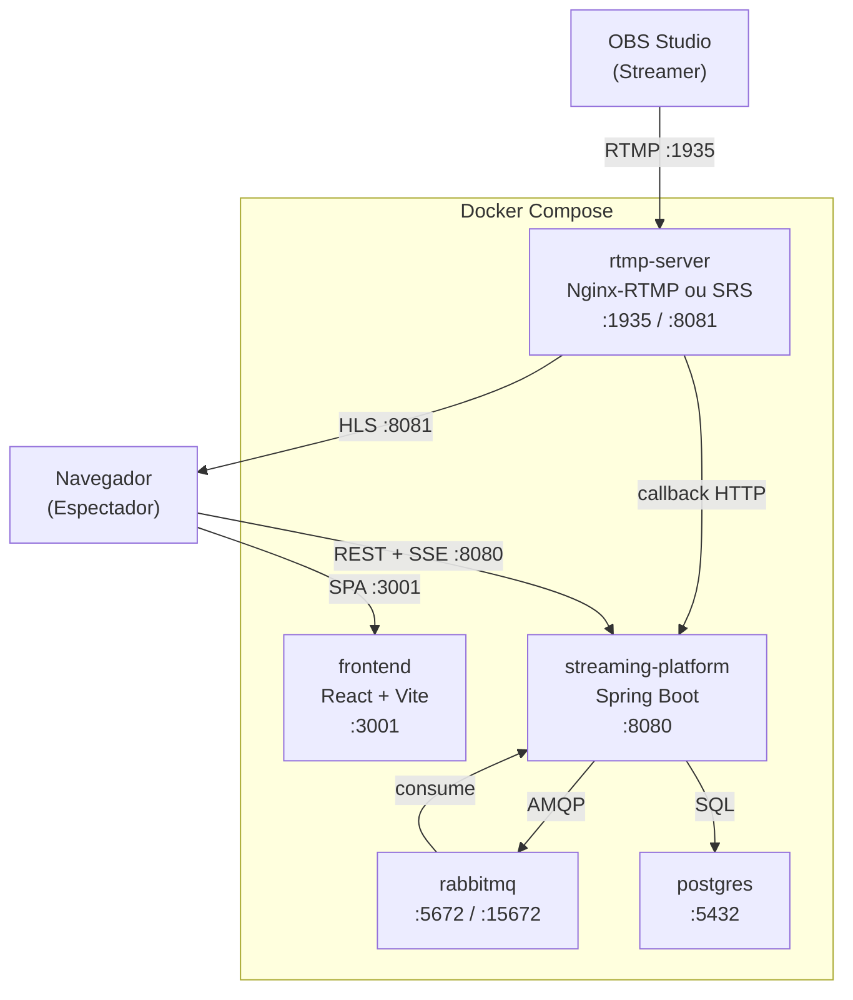
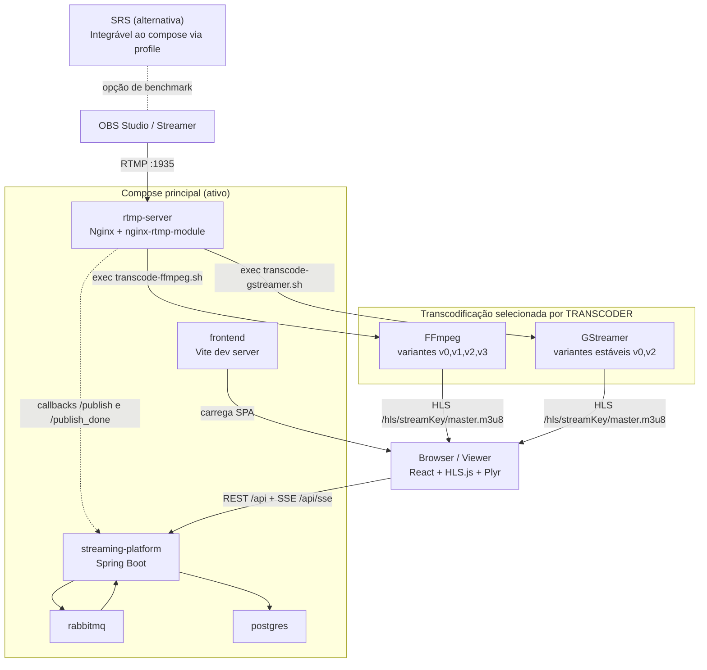
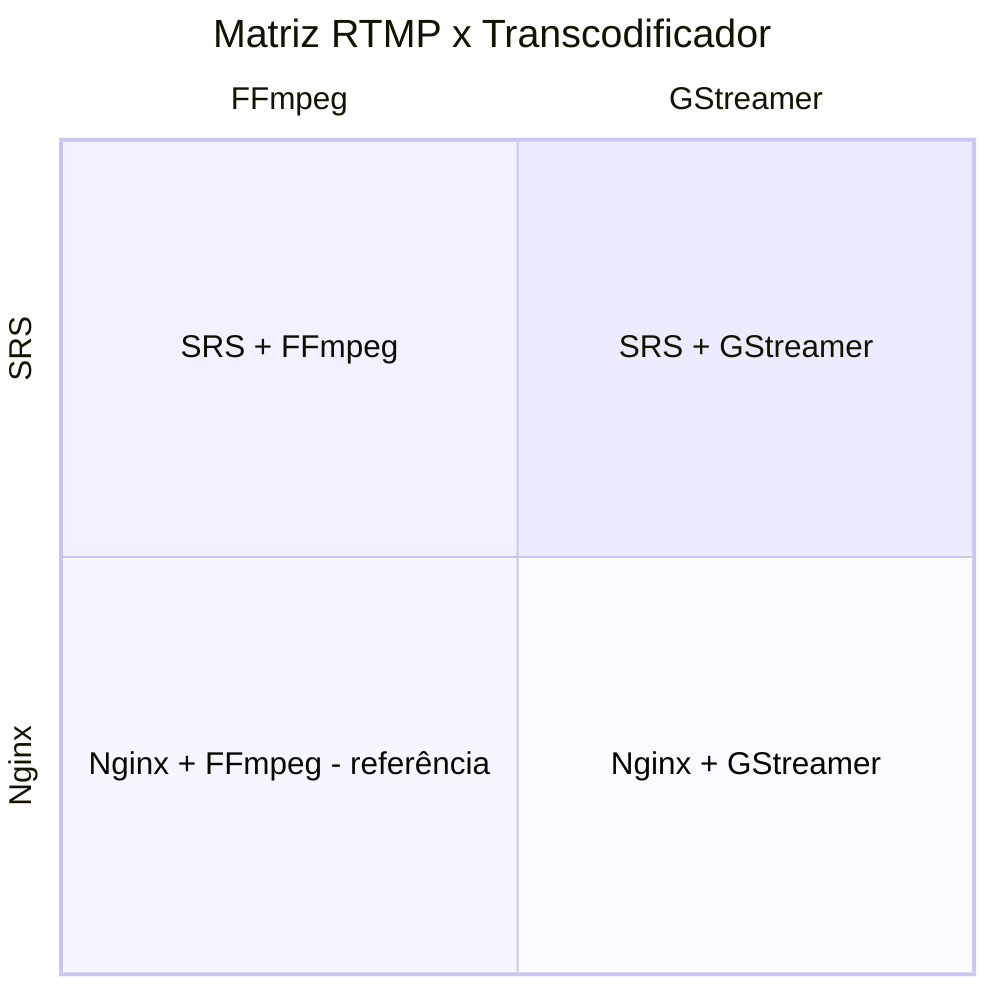

# TCC — Plataforma de Streaming com Análise Comparativa

**Tipo:** Trabalho de Conclusão de Curso
**Período:** Janeiro – Junho 2026
**Objetivo geral:** Avaliar e comparar o desempenho de combinações de servidores RTMP (Nginx-RTMP, SRS) e transcodificadores (FFmpeg, GStreamer) em uma plataforma de streaming ao vivo.

---

## 1. Especificações Técnicas

### Linguagens

| Linguagem | Uso |
|---|---|
| Java 21 | Backend (streaming-platform) |
| TypeScript | Frontend (SPA) |
| Bash | Scripts de transcodificação e entrypoints |
| Python 3 | Servidor HTTP com CORS para HLS (SRS) |

### Frameworks e Bibliotecas

| Camada | Tecnologia | Versão |
|---|---|---|
| Backend | Spring Boot | 3.2.2 |
| Backend | Spring Data JPA | — |
| Backend | Spring AMQP | — |
| Backend | Spring Retry | — |
| Backend | SpringDoc OpenAPI | — |
| Backend | Micrometer + Prometheus | — |
| Frontend | React | 19 |
| Frontend | Vite | 7 |
| Frontend | React Router | 7 |
| Frontend | TanStack Query | 5 |
| Frontend | HLS.js | — |
| Frontend | Plyr | — |
| Frontend | Tailwind CSS | 4 |
| Frontend | Axios | — |

### Ferramentas e Infraestrutura

| Componente | Tecnologia | Versão |
|---|---|---|
| Banco de dados | PostgreSQL | 16 |
| Mensageria | RabbitMQ | 3 (management) |
| Ingestão RTMP | Nginx com nginx-rtmp-module | 1.24 |
| Ingestão RTMP (alt.) | SRS (Simple Realtime Server) | 6 |
| Transcodificação | FFmpeg | — |
| Transcodificação (alt.) | GStreamer | — |
| Orquestração | Docker Compose | — |
| Comunicação tempo real | Server-Sent Events (SSE) | — |

---

## 2. Diagrama de Containers

---

## 3. Diagrama de Arquitetura (com Alternativas)

As quatro combinações possíveis são:

| Servidor RTMP | Transcodificador | Status |
|---|---|---|
| Nginx-RTMP | FFmpeg | Ativo (compose padrão) |
| Nginx-RTMP | GStreamer | Ativo (via `TRANSCODER=gstreamer`) |
| SRS | FFmpeg | Ativo (via `--profile srs`) |
| SRS | GStreamer | Ativo (via `--profile srs` + `TRANSCODER=gstreamer`) |

---

## 4. RTMP — Visão Geral

### Fluxo de publicação

1. Streamer publica em `rtmp://host:1935/live/{streamKey}`.
2. Servidor RTMP dispara callback `on_publish` para o backend.
3. Backend valida a stream key e transiciona o status para `LIVE`.
4. Servidor RTMP executa o script de transcodificação com a stream key como argumento.
5. Transcodificador gera `master.m3u8` e segmentos em `/tmp/hls/{streamKey}/`.
6. Quando o streamer encerra, o callback `on_publish_done` transiciona o status para `ENDED`.

### Variáveis de ambiente relevantes

| Variável | Padrão | Descrição |
|---|---|---|
| `TRANSCODER` | `ffmpeg` | Seleciona o transcodificador (`ffmpeg` ou `gstreamer`) |
| `HLS_PATH` | `/tmp/hls` | Diretório de saída dos segmentos HLS |
| `HLS_HTTP_PORT` | `8081` | Porta HTTP que serve os arquivos HLS |
| `RTMP_PORT` | `1935` | Porta de ingestão RTMP |
| `HLS_SEGMENT_DURATION` | `6` | Duração de cada segmento HLS (segundos) |
| `HLS_PLAYLIST_LENGTH` | `10` | Número de segmentos mantidos na playlist |
| `HLS_RETENTION_HOURS` | `6` | Retenção de arquivos HLS após inatividade |
| `BACKEND_HOST` | `streaming-platform` | Hostname do backend para callbacks |

### Perfis de transcodificação

**FFmpeg** — 4 variantes:

| Variante | Resolução |
|---|---|
| v0 | 1080p |
| v1 | 720p |
| v2 | 480p |
| v3 | 360p |

**GStreamer** — 2 variantes estáveis:

| Variante | Resolução |
|---|---|
| v0 | 1080p |
| v2 | 480p |

> GStreamer anuncia apenas v0 e v2 no `master.m3u8` para evitar 404 em playlists inexistentes.

### Limpeza de arquivos HLS

O cron executa `cleanup-hls.sh` a cada hora. Arquivos `.ts`, `.m3u8` e `.log` mais antigos que `HLS_RETENTION_HOURS` são removidos.

---

## 5. Matriz de Comparação

As quatro combinações são o objeto central do estudo comparativo. As métricas coletadas permitirão posicionar cada combinação quanto a latência, uso de recursos e qualidade de entrega.

---

## 6. Plano de Testes

### Título

Análise Comparativa de Desempenho de Servidores RTMP e Transcodificadores em Plataforma de Streaming ao Vivo

### Objetivo

Medir e comparar, nas quatro combinações (Nginx/SRS × FFmpeg/GStreamer), as métricas de latência ponta-a-ponta, uso de CPU, uso de memória, bitrate efetivo de saída e estabilidade do pipeline de transcodificação, sob diferentes cargas de espectadores simultâneos.

### Ambiente de Testes

| Item | Especificação |
|---|---|
| Sistema Operacional | Ubuntu 22.04 LTS (x86\_64) |
| Arquitetura | x86\_64 |
| CPU | A definir (ex: Intel Core i7 ou equivalente) |
| RAM | A definir (recomendado ≥ 16 GB) |
| Armazenamento | SSD; `/tmp` em tmpfs (ou disco) |
| Rede | Loopback (testes locais) / LAN (testes com carga) |
| Virtualização | Docker Engine (sem VM adicional) |

### Fatores e Níveis

| Fator | Níveis |
|---|---|
| Servidor RTMP | Nginx-RTMP, SRS |
| Transcodificador | FFmpeg, GStreamer |
| Número de espectadores | 1, 10, 50 |
| Resolução de entrada (OBS) | 1080p30, 720p30 |
| Bitrate de entrada (OBS) | 4000 kbps, 6000 kbps |

### Matriz Experimental

Combinação completa (fatorial) dos fatores principais:

| Teste | Servidor | Transcodificador | Espectadores | Resolução entrada |
|---|---|---|---|---|
| T01 | Nginx | FFmpeg | 1 | 1080p |
| T02 | Nginx | FFmpeg | 10 | 1080p |
| T03 | Nginx | FFmpeg | 50 | 1080p |
| T04 | Nginx | GStreamer | 1 | 1080p |
| T05 | Nginx | GStreamer | 10 | 1080p |
| T06 | Nginx | GStreamer | 50 | 1080p |
| T07 | SRS | FFmpeg | 1 | 1080p |
| T08 | SRS | FFmpeg | 10 | 1080p |
| T09 | SRS | FFmpeg | 50 | 1080p |
| T10 | SRS | GStreamer | 1 | 1080p |
| T11 | SRS | GStreamer | 10 | 1080p |
| T12 | SRS | GStreamer | 50 | 1080p |

Cada teste executado com duração mínima de 5 minutos de stream ativa. Repetições: 3 por combinação.

### Métricas de Desempenho

| Métrica | Unidade | Coleta |
|---|---|---|
| Latência ponta-a-ponta (OBS → player) | segundos | Manual / marca de tempo visível no vídeo |
| Latência de startup HLS (primeiro segmento disponível) | segundos | Log do transcodificador |
| Uso de CPU do container rtmp-server | % | `docker stats` |
| Uso de memória do container rtmp-server | MB | `docker stats` |
| Bitrate efetivo de saída por variante | kbps | Análise de segmentos `.ts` |
| Taxa de erros de segmento (404 / falhas HLS.js) | contagem | Log do player |
| Tempo até primeiro segmento após `on_publish` | segundos | Log do transcodificador |
| Estabilidade do pipeline (restarts por sessão) | contagem | Log do transcodificador |

### Ferramentas de Testes

| Ferramenta | Finalidade |
|---|---|
| OBS Studio | Publicação RTMP com parâmetros controlados |
| FFprobe | Análise de segmentos HLS e bitrate |
| `docker stats` | Monitoramento de CPU e memória por container |
| HLS.js (debug mode) | Erros de segmento e tempo de startup no player |
| Prometheus + Micrometer | Métricas de aplicação (backend) |
| Script de carga (headless) | Simular múltiplos espectadores via SSE/HLS |
| Planilha | Consolidação e análise estatística dos dados |

### Critério de Aceitação

| Critério | Valor mínimo aceitável |
|---|---|
| Latência ponta-a-ponta | ≤ 30 segundos (HLS low-latency não está no escopo) |
| Startup HLS | ≤ 15 segundos após início da transmissão |
| CPU em regime (1 espectador) | ≤ 80% de um núcleo |
| Estabilidade do pipeline | 0 restarts involuntários em 5 minutos |
| Taxa de erros de segmento | ≤ 1% dos segmentos solicitados |
| Disponibilidade de variantes | Todas as variantes anunciadas no `master.m3u8` devem responder 200 |
